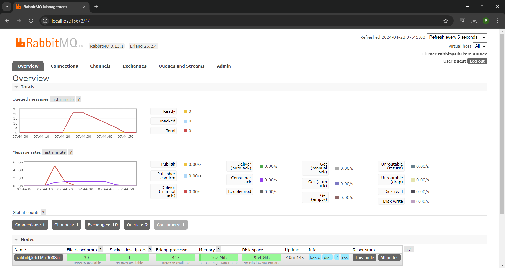
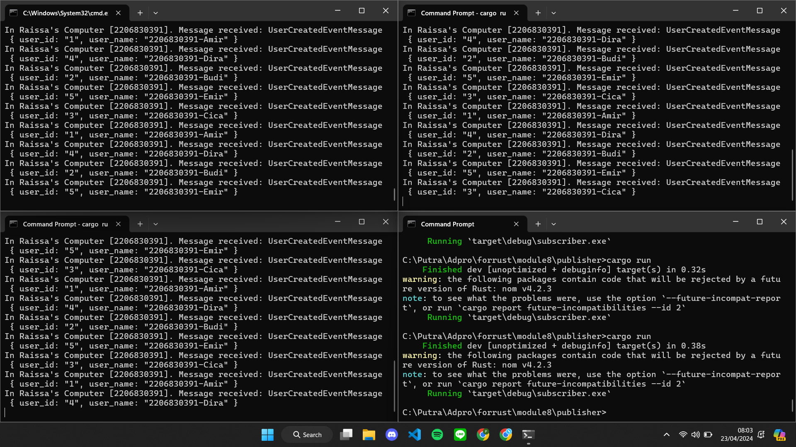
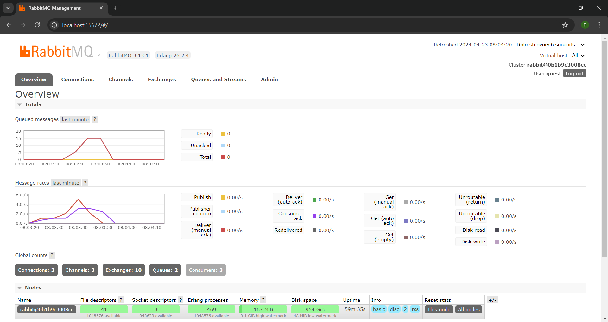

# Tutorial 8

### what is ***amqp***?

AMQP merupakan singkatan dari Advanced Message Queuing Protocol. AMQP adalah sebuah protokol aplikasi tingkat tinggi yang dirancang untuk mendukung pertukaran pesan antara berbagai komponen perangkat lunak yang terpisah. Pada `main.rs`, AMQP digunakan untuk mengatur pertukaran pesan antara komponen aplikasi yang berjalan secara asinkron, memanfaatkan fitur-fitur AMQP seperti antrean pesan dan penukaran pesan.

### what it means? *guest:guest@localhost:5672* , what is the first guest, and what is the second guest, and what is localhost:5672 is for?

`guest:guest@localhost:5672` adalah URI koneksi yang digunakan untuk menjalin koneksi ke broker AMQP.

`guest:guest`: merujuk pada nama pengguna dan kata sandi yang digunakan untuk autentikasi saat terhubung ke broker AMQP. Kata pertama "guest" merupakan nama pengguna, sedangkan kata kedua "guest" adalah kata sandi.

`localhost:5672`: Bagian ini menentukan nama host dan port dari broker AMQP. "localhost" mengacu pada mesin lokal tempat kode berjalan, menunjukkan bahwa broker berjalan pada mesin yang sama. Nomor port 5672 adalah port default untuk komunikasi AMQP.

## Simulation slow subscriber

Total queue adalah 20 setelah menjalakan 5 kali cargo run. Queue meningkat karena peningkatan jumlah event yang didelay untuk diproses oleh subscriber. Karena diperlukan waktu lebih lama untuk memproses setiap pesan, pesan-pesan baru terus bertumpuk di queue broker tanpa segera diproses. 

## Reflection and Running at least three subscribers

Ketika subscriber dijalankan di tiga konsol secara bersamaan, terjadi distribusi pemrosesan yang merata di antara mereka, memungkinkan pesan-pesan yang dikirim oleh subscriber diproses lebih cepat. Total queue berkurang menjadi 15 walaupun publisher dijalankan 10 kali. Spike dalam queue di message broker berkurang, menunjukkan peningkatan dalam kinerja dan skalabilitas sistem secara keseluruhan.